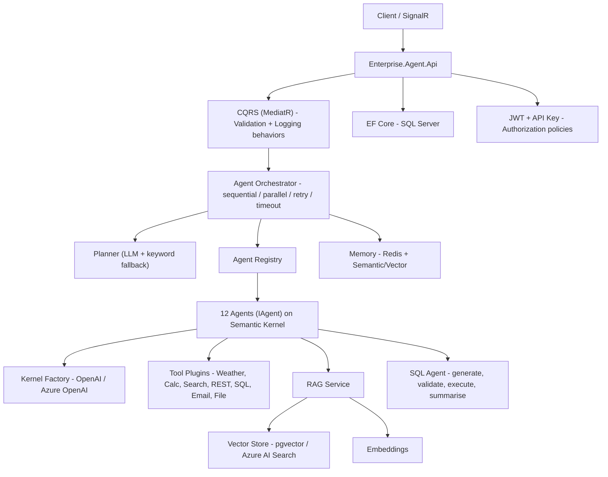

# Enterprise Multi-Agent AI Platform

A production-oriented, **.NET 10** multi-agent AI platform built on **Semantic Kernel** and **Microsoft.Extensions.AI**. It orchestrates twelve specialised agents behind a clean, layered architecture and exposes them through a secured ASP.NET Core Web API with RAG, a natural-language SQL agent, pluggable vector stores, multi-tier memory, tool/plugin calling, JWT/API-key security, structured logging and real-time streaming.

> This is a full solution, not a demo: every project compiles, every interface has an implementation, and the test suite (unit + integration) runs green with the LLM providers mocked.

---

## Highlights

- **12 agents** — Planner, Coordinator, Research, SQL, RAG, Writer, Reviewer, Document, Email, Code, Summarizer, Analytics. Every agent implements `IAgent` and runs on Semantic Kernel.
- **Orchestrator** — sequential & parallel workflows, per-step retries, timeouts, cancellation, execution context and full execution history.
- **Planner** — an LLM planner that emits a JSON plan, with a deterministic keyword planner as a fallback.
- **RAG** — ingestion, chunking, embeddings, vector storage, similarity search and grounded, cited answers. Supports **PDF, Word, Markdown, Text**.
- **Vector stores** — **PostgreSQL + pgvector** and **Azure AI Search**, both behind `IVectorStore`.
- **Memory** — conversation (Redis), long-term (Redis) and semantic/vector memory.
- **SQL agent** — natural language, then generate, then **validate (read-only safety guard)**, then execute, then summarise. Destructive statements are blocked.
- **Tools as SK plugins** — Weather, Calculator, Search, REST API, SQL, Email, File.
- **Provider-agnostic AI** — OpenAI or Azure OpenAI selected purely by configuration.
- **Cross-cutting** — Serilog structured logging with correlation IDs, MediatR CQRS with validation/logging behaviors, FluentValidation, JWT + API-key auth with authorization policies, Scalar API reference, SignalR, EF Core (code-first + migrations), Docker/Compose, GitHub Actions.

---

## Architecture



### Solution layout

```
EnterpriseAIAgent.sln
|- src/
|  |- Enterprise.Agent.Shared          # Result, guards, exceptions, correlation, clock
|  |- Enterprise.Agent.Models          # Domain records, DTOs, enums, agent contracts
|  |- Enterprise.Agent.Prompts         # Versioned prompt library (defaults + embedded files)
|  |- Enterprise.Agent.Core            # IAgent, 12 agents, orchestrator, planners, CQRS, abstractions
|  |- Enterprise.Agent.Tools           # Semantic Kernel tool plugins
|  |- Enterprise.Agent.Plugins         # Tool registry (catalogue + direct invocation)
|  |- Enterprise.Agent.VectorStore     # pgvector + Azure AI Search behind IVectorStore
|  |- Enterprise.Agent.Memory          # Conversation / long-term / semantic memory (Redis + vector)
|  |- Enterprise.Agent.Security        # JWT token service, API-key auth, authorization policies
|  |- Enterprise.Agent.Persistence     # EF Core DbContext, entities, repositories, migrations
|  |- Enterprise.Agent.Infrastructure  # AI providers, RAG pipeline, SQL agent, email, DI aggregation
|  \- Enterprise.Agent.Api             # ASP.NET Core Web API, controllers, hub, middleware
\- tests/
   |- Enterprise.Agent.UnitTests
   \- Enterprise.Agent.IntegrationTests
```

Dependencies flow inward: `Api -> Infrastructure -> (VectorStore, Memory, Tools, Plugins, Persistence, Security) -> Core -> (Prompts, Models) -> Shared`.

---

## Prerequisites

- [.NET 10 SDK](https://dotnet.microsoft.com/download)
- Docker & Docker Compose (for the full local stack)
- An **OpenAI** or **Azure OpenAI** key for live LLM calls (the code runs and tests pass without one; live agent calls require it)

---

## Configuration

All settings live in `src/Enterprise.Agent.Api/appsettings.json` and can be overridden by environment variables (double-underscore syntax, e.g. `Ai__OpenAI__ApiKey`). **Never commit secrets** - supply them via environment variables, user-secrets or a secret store.

| Section | Key settings |
| --- | --- |
| `Ai` | `Provider` (`OpenAI`/`AzureOpenAI`/empty=auto), `OpenAI.ApiKey`, `AzureOpenAI.Endpoint`/`ApiKey`, `EmbeddingDimensions` |
| `Orchestrator` | `MaxRetries`, `RetryDelay`, `StepTimeout`, `MaxDegreeOfParallelism`, `StopOnFirstFailure` |
| `Planner` | `UseLlmPlanner`, `PromptName`, `FallbackAgent` |
| `Rag` | `DefaultCollection`, `ChunkSize`, `ChunkOverlap`, `TopK` |
| `VectorStore` | `Provider` (`Postgres`/`AzureAiSearch`) + per-provider connection settings |
| `Memory` | `RedisConnectionString`, `ConversationTtlMinutes`, `SemanticCollection` |
| `SqlAgent` | `ConnectionString`, `DefaultMaxRows`, `StaticSchema` |
| `Persistence` | `ConnectionString`, `AutoMigrate` |
| `Jwt` / `ApiKeys` | signing key, issuer/audience; valid API keys |
| `Smtp` / `Tools` | email transport; per-tool settings |

Set the AI key, for example:

```bash
export Ai__OpenAI__ApiKey="sk-..."      # macOS/Linux
setx Ai__OpenAI__ApiKey "sk-..."        # Windows
```

---

## Running locally (SDK)

```bash
dotnet restore EnterpriseAIAgent.sln
dotnet build   EnterpriseAIAgent.sln -c Release
dotnet run --project src/Enterprise.Agent.Api
```

Then browse to **`https://localhost:7080/scalar/v1`** (or `http://localhost:5080/scalar/v1`).

### Database migrations (EF Core, code-first)

```bash
# Add a migration
dotnet ef migrations add <Name> \
  --project src/Enterprise.Agent.Persistence \
  --startup-project src/Enterprise.Agent.Persistence

# Apply to a database (or let the API auto-migrate on startup)
dotnet ef database update \
  --project src/Enterprise.Agent.Persistence \
  --startup-project src/Enterprise.Agent.Persistence
```

An `InitialCreate` migration is included.

---

## Running with Docker

Brings up the API plus **SQL Server**, **Redis** and **PostgreSQL + pgvector**:

```bash
cp .env.example .env      # add your AI key and a JWT signing key
docker compose up --build
```

- API (Scalar UI): http://localhost:8080/scalar/v1  ·  OpenAPI JSON: http://localhost:8080/openapi/v1.json
- SQL Server: `localhost:1433` - Redis: `localhost:6379` - Postgres: `localhost:5432`

---

## Authentication

Two schemes are supported and combined by the `ApiKeyOrJwt` policy.

```bash
# 1) Get a JWT (development issuance endpoint)
curl -X POST http://localhost:8080/api/auth/token \
  -H "Content-Type: application/json" \
  -d '{"subject":"alice","roles":["operator"]}'

# 2) Call an endpoint with the token
curl http://localhost:8080/api/agents -H "Authorization: Bearer <token>"

# ... or with an API key
curl http://localhost:8080/api/agents -H "X-Api-Key: dev-local-api-key-change-me"
```

---

## API surface

| Method & path | Description |
| --- | --- |
| `POST /api/chat` | Plan + run agents for a message; returns the synthesised answer |
| `GET  /api/agents` | List agents and capabilities |
| `POST /api/agents/plan` | Produce a plan for a goal (no execution) |
| `POST /api/agents/{name}` | Invoke a single agent directly |
| `POST /api/rag/query` , `POST /api/rag/answer` | Retrieve context / grounded answer |
| `POST /api/documents/upload` , `POST /api/documents/ingest` | Ingest documents (multipart or base64) |
| `POST /api/sql/query` | Natural-language SQL (read-only, validated) |
| `GET  /api/memory/conversation/{id}` , `POST /api/memory/semantic` | Memory operations |
| `GET  /api/tools` , `POST /api/tools/invoke` | List / invoke tool plugins |
| `GET  /api/health` , `GET /health` | Health |
| `hub /hubs/chat` | SignalR real-time chat |

Example chat call:

```bash
curl -X POST http://localhost:8080/api/chat \
  -H "X-Api-Key: dev-local-api-key-change-me" \
  -H "Content-Type: application/json" \
  -d '{"message":"Summarise our Q3 sales and draft an email to the team."}'
```

---

## Web UI (Enterprise.Agent.Ui)

A Razor Pages front-end (`src/Enterprise.Agent.Ui`) provides a complete console over every capability. It is a thin client of the REST API: pages call the API over HTTP with the `X-Api-Key` header attached server-side (the key never reaches the browser), and the Chat page connects to the API's SignalR hub in real time. Styling uses Tailwind (CDN).

Pages: Dashboard, Chat (real-time), Agents (list / plan / run), Knowledge/RAG (ingest, retrieve, grounded answer), SQL Agent, Memory (conversation + semantic), Tools (list / invoke) and an Auth/token helper.

Run the API and the UI together (two terminals):

```bash
dotnet run --project src/Enterprise.Agent.Api    # API  -> http://localhost:5080
dotnet run --project src/Enterprise.Agent.Ui     # UI   -> http://localhost:5090
```

Then open **http://localhost:5090**. Configure the API target under the UI's `Api` settings:

```json
"Api": { "BaseUrl": "http://localhost:5080", "PublicBaseUrl": "http://localhost:5080", "ApiKey": "dev-local-api-key-change-me" }
```

`BaseUrl` is used for server-side API calls; `PublicBaseUrl` is the address the browser uses to reach the SignalR hub for chat.

---

## Projects

| Project | Responsibility |
| --- | --- |
| `Enterprise.Agent.Shared` | Cross-cutting primitives: `Result`/`Error`, guards, domain exceptions, correlation context, clock, constants. |
| `Enterprise.Agent.Models` | Domain records, DTOs and enums; agent/orchestration/chat/RAG/SQL/tool/memory contracts. |
| `Enterprise.Agent.Prompts` | Versioned prompt library — built-in defaults plus embedded `*.prompt.md` files, addressed by name + version. |
| `Enterprise.Agent.Core` | `IAgent` + the 12 agents, orchestrator, planners, CQRS (MediatR) + validation/logging behaviors, and all layer abstractions. |
| `Enterprise.Agent.Tools` | Semantic Kernel tool plugins (Weather, Calculator, Search, REST, SQL, Email, File). |
| `Enterprise.Agent.Plugins` | Tool registry — catalogues plugins and invokes them directly. |
| `Enterprise.Agent.VectorStore` | `IVectorStore` implementations: PostgreSQL + pgvector and Azure AI Search, behind a selecting factory. |
| `Enterprise.Agent.Memory` | Conversation and long-term memory (Redis) and semantic/vector memory. |
| `Enterprise.Agent.Security` | JWT token service, API-key authentication handler, authorization policies. |
| `Enterprise.Agent.Persistence` | EF Core `DbContext`, entities, repositories and migrations (SQL Server). |
| `Enterprise.Agent.Infrastructure` | AI providers (OpenAI/Azure), RAG pipeline, SQL agent, email transport, and DI aggregation. |
| `Enterprise.Agent.Api` | ASP.NET Core Web API: controllers, SignalR hub, middleware, Scalar/OpenAPI. |
| `Enterprise.Agent.Ui` | Razor Pages front-end (thin REST client + SignalR chat). |
| `Enterprise.Agent.UnitTests` / `Enterprise.Agent.IntegrationTests` | xUnit tests with a mocked LLM and in-memory EF. |

## Agent catalogue

The planner selects one or more agents for a goal; each implements `IAgent` and runs on Semantic Kernel.

| Agent | Role | Purpose | Example triggers |
| --- | --- | --- | --- |
| CoordinatorAgent | Coordinator | Synthesises multiple agent outputs into one coherent answer | (final synthesis step) |
| PlannerAgent | Planner | Decomposes a goal into an ordered plan of agent steps | plan, steps, break down |
| ResearchAgent | Research | Produces a factual, organised briefing (tool-enabled) | research, investigate, what is |
| SqlAgent | Sql | Natural-language, read-only database queries | sql, database, how many, records |
| RagAgent | Rag | Answers grounded in the knowledge base, with citations | documents, according to, cite |
| WriterAgent | Writer | Polished prose in the requested tone/format | write, draft, article, letter |
| ReviewerAgent | Reviewer | Reviews drafts for accuracy, clarity, tone | review, critique, proofread |
| DocumentAgent | Document | Summarise / extract / restructure document content | document, extract, pdf, contract |
| EmailAgent | Email | Drafts (and via tools can send) email | email, reply, compose email |
| CodeAgent | Code | Generates and refactors complete code | code, implement, refactor, api |
| SummarizerAgent | Summarizer | Faithful, concise summaries | summarize, tldr, condense |
| AnalyticsAgent | Analytics | Insights, anomalies and recommendations over data | analyze, metrics, trend, kpi |

## Configuration reference

All settings live in `src/Enterprise.Agent.Api/appsettings.json` and can be overridden by environment variables using the `Section__Key` convention (double underscore), e.g. `Ai__OpenAI__ApiKey`. **Never commit secrets.**

| Section | Keys (default) |
| --- | --- |
| `Ai` | `Provider` (empty = auto-detect), `EmbeddingDimensions` (1536) |
| `Ai:OpenAI` | `ApiKey`, `ChatModel` (gpt-4o-mini), `EmbeddingModel` (text-embedding-3-small), `OrganizationId` |
| `Ai:AzureOpenAI` | `Endpoint`, `ApiKey`, `ChatDeployment`, `EmbeddingDeployment`, `ApiVersion` (2024-10-21) |
| `Orchestrator` | `MaxRetries` (2), `RetryDelay` (00:00:00.5), `StepTimeout` (00:02:00), `MaxDegreeOfParallelism` (4), `StopOnFirstFailure` (true) |
| `Planner` | `UseLlmPlanner` (true), `PromptName` (planner), `PromptVersion` (latest), `FallbackAgent` (ResearchAgent) |
| `AgentDefaults` | `Temperature` (0.2), `TopP` (1.0), `MaxTokens` (1024) |
| `Rag` | `DefaultCollection` (knowledge), `ChunkSize` (1200), `ChunkOverlap` (200), `TopK` (5), `MinScore` (0.0) |
| `VectorStore` | `Provider` (Postgres), `Postgres:ConnectionString`, `Postgres:TablePrefix` (vec_), `AzureAiSearch:Endpoint`, `AzureAiSearch:ApiKey`, `AzureAiSearch:ApiVersion` |
| `Memory` | `RedisConnectionString` (localhost:6379), `KeyPrefix` (eaa), `ConversationTtlMinutes` (240), `SemanticCollection` (memory), `EmbeddingDimensions` (1536) |
| `SqlAgent` | `ConnectionString`, `DefaultMaxRows` (100), `StaticSchema`, `CommandTimeoutSeconds` (30) |
| `Smtp` | `Enabled` (false), `Host`, `Port` (587), `UseSsl` (true), `Username`, `Password`, `From` |
| `Tools:Search` | `Endpoint`, `ApiKey`, `MaxResults` (5) |
| `Tools:Weather` | `EndpointFormat` (keyless wttr.in JSON) |
| `Tools:RestApi` | `AllowedHosts` (empty = allow all), `TimeoutSeconds` (30) |
| `Tools:File` | `BasePath` (temp workspace), `MaxReadBytes` (1 MiB) |
| `Persistence` | `ConnectionString`, `AutoMigrate` (true) |
| `Jwt` | `Issuer`, `Audience`, `SigningKey`, `ExpiryMinutes` (60) |
| `ApiKeys:Keys` | map of `apiKey -> ownerName` |

The UI (`Enterprise.Agent.Ui`) has its own `Api` section: `BaseUrl` (server-side calls), `PublicBaseUrl` (browser → SignalR hub) and `ApiKey`.

## Endpoint reference

All endpoints require authentication (`ApiKeyOrJwt`) except `/api/auth/token`, `/api/health` and `/health`. `/api/sql/query` additionally requires the operator/admin role. Send either `Authorization: Bearer <jwt>` or `X-Api-Key: <key>`.

| Method | Path | Body / query | Purpose |
| --- | --- | --- | --- |
| POST | `/api/auth/token` | `{ subject, roles[], tenantId? }` | Issue a signed JWT (dev issuance) |
| POST | `/api/chat` | `{ message, conversationId?, preferredAgent?, useMemory, useRag }` | Plan + run agents; returns synthesised answer |
| GET | `/api/agents` | — | List agents and capabilities |
| POST | `/api/agents/plan` | `{ goal }` | Produce a plan (no execution) |
| POST | `/api/agents/{name}` | `{ input, parameters? }` | Invoke a single agent |
| POST | `/api/rag/query` | `{ query, collection?, topK }` | Retrieve top-k chunks |
| POST | `/api/rag/answer` | `{ query, collection? }` | Grounded, cited answer |
| POST | `/api/documents/upload` | multipart `file`, `?collection` | Upload + ingest a document |
| POST | `/api/documents/ingest` | `{ documentId, fileName, documentType, contentBase64, collection? }` | Ingest base64 content |
| GET | `/api/documents` | `?collection` | List ingested documents |
| POST | `/api/sql/query` | `{ question, dataSource?, maxRows }` | NL → SQL (read-only) |
| GET | `/api/memory/conversation/{id}` | `?limit` | Recent conversation memory |
| POST | `/api/memory/semantic` | `{ key, content, userId?, conversationId? }` | Store semantic memory |
| GET | `/api/memory/semantic/recall` | `?query&limit` | Recall by similarity |
| GET | `/api/tools` | — | List tool functions |
| POST | `/api/tools/invoke` | `{ plugin, function, arguments{} }` | Invoke a tool directly |
| GET | `/api/health` · `/health` | — | Health |
| HUB | `/hubs/chat` | `SendMessage(ChatRequest)`; events `Acknowledged`, `ReceiveMessage` | Real-time chat |

Example — invoke the calculator tool:

```bash
curl -X POST http://localhost:5080/api/tools/invoke \
  -H "X-Api-Key: dev-local-api-key-change-me" -H "Content-Type: application/json" \
  -d '{"plugin":"Calculator","function":"evaluate","arguments":{"expression":"3 + 4 * (2 - 1)"}}'
```

## Extending the platform

- **Add an agent** — create a class implementing `IAgent` (or deriving `AgentBase` for a prompt-driven agent), add its prompt to the library, and register it in `Enterprise.Agent.Core/DependencyInjection.AddAgents`. The planner picks it up automatically via its descriptor keywords.
- **Add a tool** — implement `IKernelPluginSource` with `[KernelFunction]`-annotated methods and register it in `Enterprise.Agent.Tools/DependencyInjection.AddTools`. It becomes available to agents and via `/api/tools`.
- **Add a vector store** — implement `IVectorStore`, add a value to the `VectorProvider` enum, wire it into `VectorStoreFactory` and register it in `Enterprise.Agent.VectorStore/DependencyInjection`.
- **Add / version a prompt** — drop a `Library/<name>.<version>.prompt.md` file (with `name`/`version`/`description` front matter) into `Enterprise.Agent.Prompts`, or add it to `DefaultPromptLibrary`. The latest version wins unless a specific version is requested.
- **Add an API endpoint** — add a controller (or MediatR request + handler in Core) and it is covered by the existing auth, logging, correlation and exception middleware.

## Troubleshooting

- **`ERR_CONNECTION_REFUSED` on `:7080`** — that port is the HTTPS profile. When you run the default (http) profile the API listens on `:5080`. Use `http://localhost:5080`, or run the https profile: `dotnet run --project src/Enterprise.Agent.Api --launch-profile https`.
- **`404` at the site root of the API** — the API root redirects to `/scalar/v1`; there is no other page at `/`. Use the documented routes.
- **`401 Unauthorized`** — supply `X-Api-Key` (see `ApiKeys:Keys`) or a `Bearer` token from `/api/auth/token`.
- **LLM calls fail / empty answers** — set `Ai:OpenAI:ApiKey` (or the Azure OpenAI settings). The app builds and tests pass without a key, but live agent calls need one.
- **SQL agent says the database is not configured** — set `SqlAgent:ConnectionString`; the agent only ever issues validated, read-only queries.
- **Database unavailable at startup** — migrations are skipped with a warning; the API still starts.
- **UI shows "API unreachable"** — start the API and check the UI's `Api:BaseUrl`. The Chat page needs `Api:PublicBaseUrl` reachable from the browser.
- **`.fuse_hidden*` files** — filesystem artifacts of the mounted drive, not part of the solution; they are git-ignored and safe to delete.

---

## Testing

```bash
dotnet test EnterpriseAIAgent.sln
```

The suite mocks the LLM (a fake Semantic Kernel chat service - "mock OpenAI"), uses the EF Core in-memory provider for API integration tests, and covers the calculator, SQL safety guard, chunker, prompt registry, planners, orchestrator (retry/timeout/parallel), the chat handler and the API endpoints.

---

## Security notes

- Secrets come from configuration/environment only - nothing is hard-coded.
- The SQL agent enforces a **read-only** policy: only `SELECT` (optionally a leading CTE) is allowed; `INSERT/UPDATE/DELETE/DDL/EXEC`, stacked statements and `SELECT ... INTO` are rejected before execution.
- JWT uses HMAC-SHA256; API keys are validated against configuration.
- Replace all development keys/passwords before deploying.

---

## Kubernetes / Azure readiness

The API is a stateless, containerised ASP.NET Core service listening on `:8080` with a health endpoint at `/health`, structured logging, and configuration via environment variables - ready for a Kubernetes `Deployment` + `Service` (add liveness/readiness probes to `/health`) or Azure Container Apps / App Service. Back it with Azure SQL, Azure Cache for Redis, Azure Database for PostgreSQL (pgvector) and Azure OpenAI by setting the corresponding configuration.

---

## Screenshots

_Placeholders - add your own captures._

| Scalar API reference | Chat flow |
| --- | --- |
| `docs/screenshots/scalar.png` | `docs/screenshots/chat.png` |

---

## License

Provided as-is for enterprise reference and internal use.
